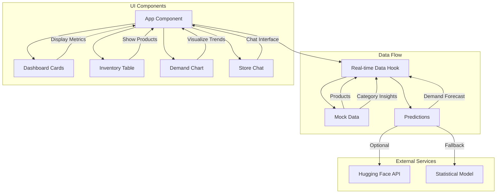

# Smart Grocery Inventory Dashboard

A real-time inventory management dashboard for grocery stores that provides predictive analytics, demand forecasting, and inventory insights. Built with React, TypeScript, and Tailwind CSS.

## Features

- 📊 Real-time inventory tracking
- 📈 Demand forecasting with interactive charts
- 🤖 AI-powered chatbot assistant
- 📱 Responsive design
- 🔄 Configurable refresh rates
- 📦 Category-based insights
- ⚠️ Low stock alerts
- 📉 Wastage risk monitoring

## Architecture



## Installation

1. Clone the repository:
```bash
git clone <repository-url>
cd smart-grocery-inventory
```

2. Install dependencies:
```bash
npm install
```

3. Create a `.env` file in the root directory:
```bash
cp .env.example .env
```

4. (Optional) Add your Hugging Face API key to the `.env` file:
```
VITE_HUGGING_FACE_API_KEY=your_api_key_here
```

5. Start the development server:
```bash
npm run dev
```

## Project Structure

```
src/
├── components/           # React components
│   ├── DashboardCard.tsx
│   ├── DemandChart.tsx
│   ├── InventoryTable.tsx
│   └── StoreChat.tsx
├── data/                # Mock data and generators
│   └── mockData.ts
├── hooks/               # Custom React hooks
│   └── useRealTimeData.ts
├── types/               # TypeScript type definitions
│   └── index.ts
├── utils/              # Utility functions
│   ├── chatbot.ts
│   └── predictions.ts
└── App.tsx            # Main application component
```

## Key Components

### DemandChart
- Interactive line chart showing demand forecasts
- Real-time updates with configurable refresh rate
- Category-based trend visualization
- Hover tooltips with detailed information

### InventoryTable
- Real-time inventory levels
- Stock alerts
- Demand indicators
- Risk assessment

### StoreChat
- AI-powered chatbot interface
- Natural language queries about inventory
- Real-time data integration
- Context-aware responses

## Data Flow

1. The `useRealTimeData` hook manages the application's real-time state
2. Mock data simulates a real database (can be replaced with actual API calls)
3. The prediction system uses either:
   - Hugging Face API for ML-based predictions
   - Fallback statistical model for basic forecasting
4. Components receive updates based on the configured refresh rate

## Development

- Built with Vite for fast development
- Uses TypeScript for type safety
- Tailwind CSS for styling
- ESLint for code quality
- React 18 with hooks for state management

## Production Build

Create a production build:

```bash
npm run build
```

The build output will be in the `dist` directory.

## Contributing

1. Fork the repository
2. Create a feature branch
3. Commit your changes
4. Push to the branch
5. Create a Pull Request

## License

Apache 2.0 License - feel free to use this project for learning or as a starting point for your own inventory management system.